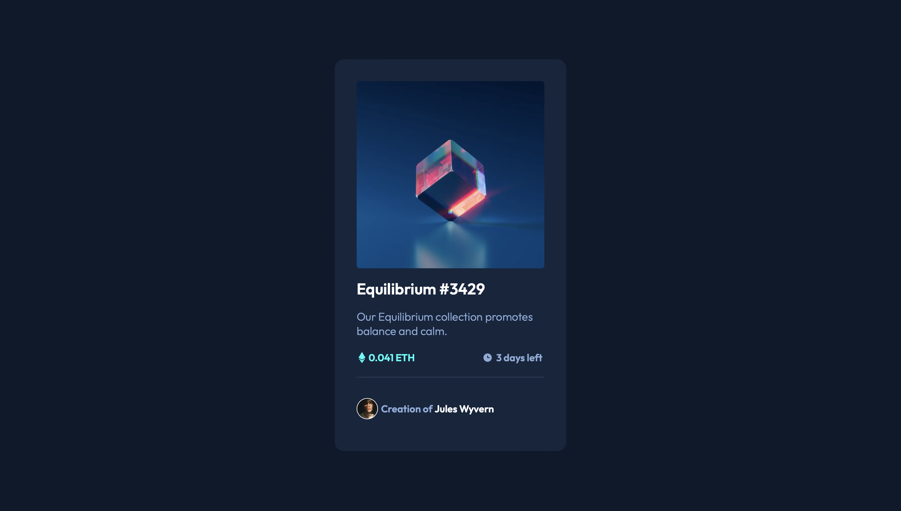

# Frontend Mentor - NFT preview card component solution

This is a solution to the [NFT preview card component challenge on Frontend Mentor](https://www.frontendmentor.io/challenges/nft-preview-card-component-SbdUL_w0U). Frontend Mentor challenges help you improve your coding skills by building realistic projects. 

## Table of contents

- [Overview](#overview)
  - [The challenge](#the-challenge)
  - [Screenshot](#screenshot)
  - [Links](#links)
- [My process](#my-process)
  - [Built with](#built-with)
  - [What I learned](#what-i-learned)
  - [Continued development](#continued-development)
  - [Useful resources](#useful-resources)
- [Author](#author)


## Overview

This is a basic NFT Preview website, built with HTML, CSS and a little bit of JS. This is my first Frontendmentor challange, and there is definitely a lot of room for improvements.  
### The challenge

Users should be able to:

- View the optimal layout depending on their device's screen size
- See hover states for interactive elements

### Screenshot



### Links

- Solution URL: [GitHub Repository](https://github.com/d4wk0m/Simple-NFT-Show)
- Live Site URL: [Live Site](https://d4wk0m.github.io/Simple-NFT-Show/)

## My process

### Built with

- Semantic HTML5 markup
- CSS custom properties


### What I learned

I've learned how to create modal images using simple JS and CSS. I also learned how to make image ovelays

```html
<div class="overlay">
    <div id="imgo">
        </div>
</div>
```
```css
.overlay {
    position: absolute;
    top: 0;
    bottom: 0;
    left: 0;
    right: 0;
    height: 100%;
    width: 100%;
    opacity: 0;
    transition: .6s ease;
    background-color: hsla(178, 100%, 50%, 0.692);
    border-radius: 5px;
}

#imgo {
    color: white;
    font-size: 100px;
    position: absolute;
    top: 50%;
    left: 50%;
    transform: translate(-50%, -50%);
    -ms-transform: translate(-50%, -50%);
    text-align: center;
}

.container:hover .overlay {
    opacity: 1;
}
```
```js
var modal = document.getElementById("myModal");

var img = document.getElementById("imgo");
var img2 = document.getElementById("myImg");
var modalImg = document.getElementById("img01");
var nft = document.getElementById("nft")

img.onclick = function() {
        modal.style.display = "block";
        modalImg.src = img2.src;
        nft.classList.remove("nft2");
    }
var span = document.getElementsByClassName("close")[0];

span.onclick = function() {
    modal.style.display = "none";
    nft.classList.add("nft2");
}
```


### Continued development

I will be focusing on using more flexbox and building more responsive websites

### Useful resources

- [W3Schools Modal image](https://www.w3schools.com/howto/howto_css_modal_images.asp) - This helped me with creating the modal image. 

## Author

- Website - [Dawid Komęza](dkomeza.great-site.net)
- Frontend Mentor - [@d4wk0m](https://www.frontendmentor.io/profile/d4wk0m)
